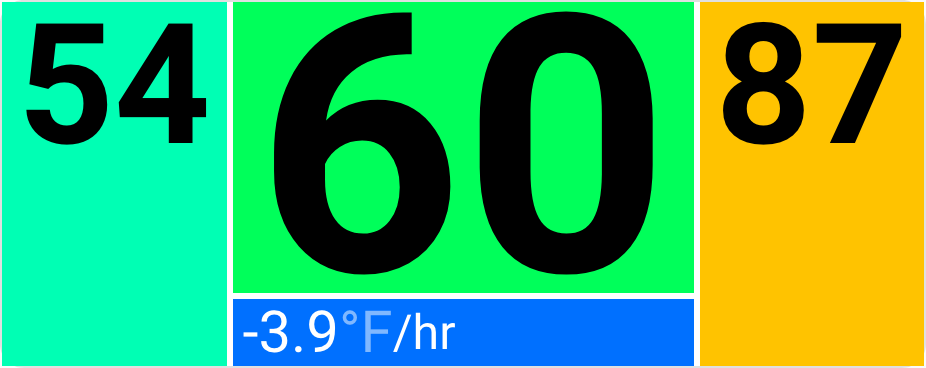

# Big Temperature card 

A simple card to display big numbers for temperature, designed to be readable from across the room for a wall tablet. It also supports colors as background for the daily low & high, and optionally for the current temperature and the trend. The numbers will auto-resize to fill the maximum amount of space possible.



The original version was based on [Bignum card](https://github.com/custom-cards/bignumber-card/), this version has been re-written from scratch.

## Options

| Name | Type | Required | Default | Example | Description |
| - | - | - | - | - | - |
| type | string | **Required** | | `custom:big-temperature-card`
| current | sensor or float | **Required** | 65.43 | `sensor.my_temperature` | Sensor to use for the current temperature.
| low | sensor or float | **Required** | 42 | `sensor.temperature_overnight_low` | Sensor to use for the forecast low.
| high | sensor or float | **Required** | 82 | `sensor.temperature_daytime_high` | Sensor to use for the forecast high.
| trend | sensor or float | optional | 1.8 | `sensor.my_temperature_trend` | The current temperature trend in °/hour
| cold | number | optional | 32 | | Your personal preference for "cold". Will be shown as blue.
| hot | number | optional | 100 | | Your personal preference for "hot". Will be shown as red.
| trend_cold | number | optional | -5 | | Your personal preference for "cold" for the trend. Will be shown as blue.
| trend_hot | number | optional | 5 | | Your personal preference for "hot" for the trend. Will be shown as red.
| color_current | boolean | optional | true | false | Color the background of the current temperature field.
| color_trend | boolean | optional | true | false | Color the background of the temperature trend.
| show_unit | boolean | optional |  false | true | Show the unit of measurement in the trend field. 
| round_to | int | optional | 0 | 1 | Number of decimals to round the current temperature to.

The `trend` setting will display a per-hour trend below the current temperature. You have to create this sensor. See below for an example.

Note, so far it only supports black text on a white background, though the colors will invert to maintain contrast based on the background colors. Pull requests welcome to make it more flexible.

## Example

### Sections

```yaml
type: custom:big-temperature-card
current: sensor.backyard_temperature_smoothed
low: sensor.pirate_weather_overnight_low_temperature_0d
high: sensor.pirate_weather_daytime_high_temperature_0d
trend: sensor.backyard_temperature_trend_change
cold: 32
hot: 100
trend_cold: -5
trend_hot: 5
color_current: true
color_trend: true
round_to: 0
show_unit: true
```

### Masonry 

Same as `Sections`, but you have to manually specify the height.

```yaml
vertical_height: 200px
```

## How to create a per hour temperature trend

```yaml
- platform: statistics
  unique_id: "01972f06-7f78-77ca-9a0b-26f4223d428c"
  name: 'Backyard Temperature Trend Change'
  state_characteristic: change
  entity_id: sensor.backyard_temperature_smoothed
  precision: 1
  sampling_size: 300
  max_age:
    minutes: 60
```